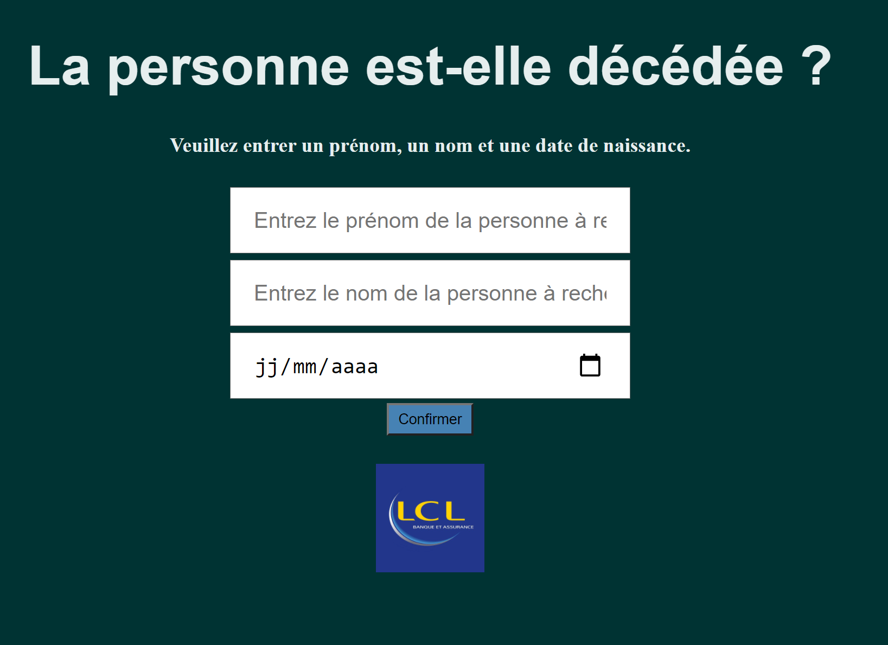
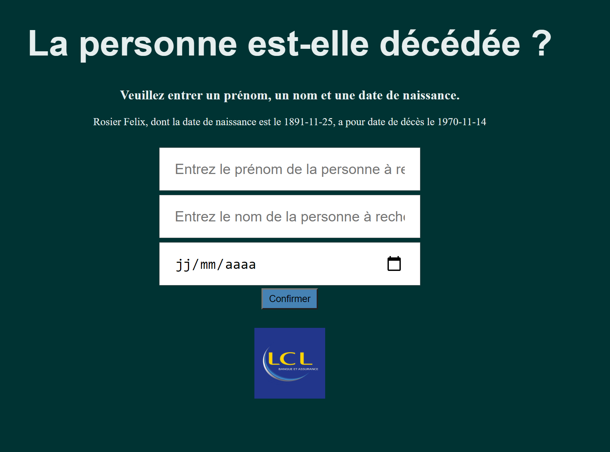

Bonjour et bienvenue sur l'application permettant de savoir si une personne est décédée ou non depuis 1970

Voici les différentes étapes :

1. Le script de RPA (Robot Processed Automation) se trouve dans le dossier rpa : `INSEE.tag`. Ce fichier comporte toutes les commandes à réaliser par le robot pour chercher les fichiers nécéssaires à l'alimentation de la base de données.
Le script se lance en ligne de commande comme ceci :
   
         tagui /chemin/vers/rpa/INSEE.tag

L'installation de tagui et de chrome sont nécessaires. Vous pouvez retrouver les liens ici : `https://tagui.readthedocs.io/en/latest/setup.html`

2. Les scripts de traitement des données se trouvent dans le dossier `data_managment`. `orchestrator.py` est le script principal pour lancer le traitement après la récuperation des données.Ce sont des traitements sur les fichiers bruts afin d'importer les données dans un dataframe pandas.
Le script data visualisation permet de réaliser de la data visualisation afin d'avoir des statistiques plus détaillées sur les data.
   

3. Le framework flask nous permet de lancer l'application web et d'avoir une interface qui propose la possiblité d'interroger la base de données
L'architecture est la suivante :
   
   * un fichier 'app.py' : script principal lancant l'application
   * un dossier templates' : contenant les fichiers html permettant de construire l'interface
   * un dossier 'static' : contenant les fichiers d'image et les fichiers css permettant de designer l'interface
    

Lorsque vous êtes sur l'interface, plusieurs paramètres en entrée de votre requête seront demandés
* `nom`
* `prenom`
* `date de naissance`

L'interface vous renverra alors l'information pour savoir si la personne est décédée ou non.

Voici la page d'accueil de l'interface

Après interrogation, celle ci vous renverra une réponse positive ou négative selon sa recherche dans la base de données : 

